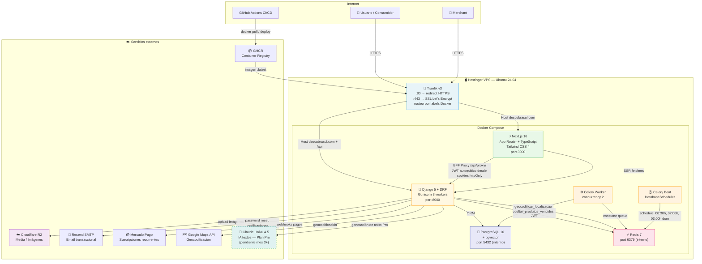
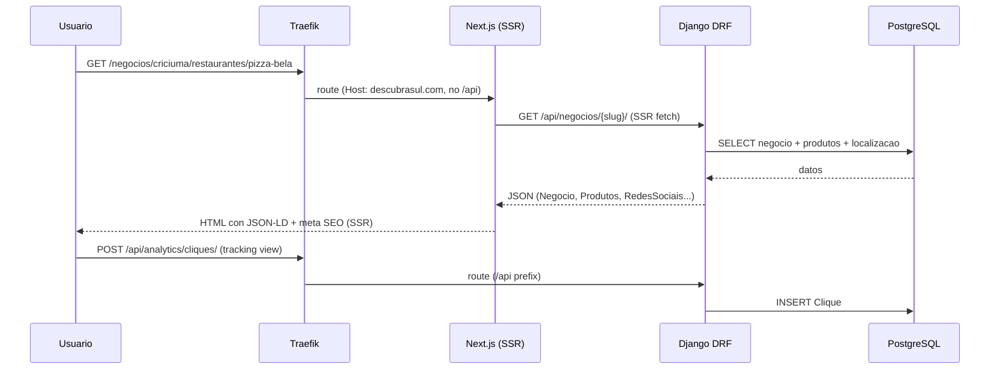
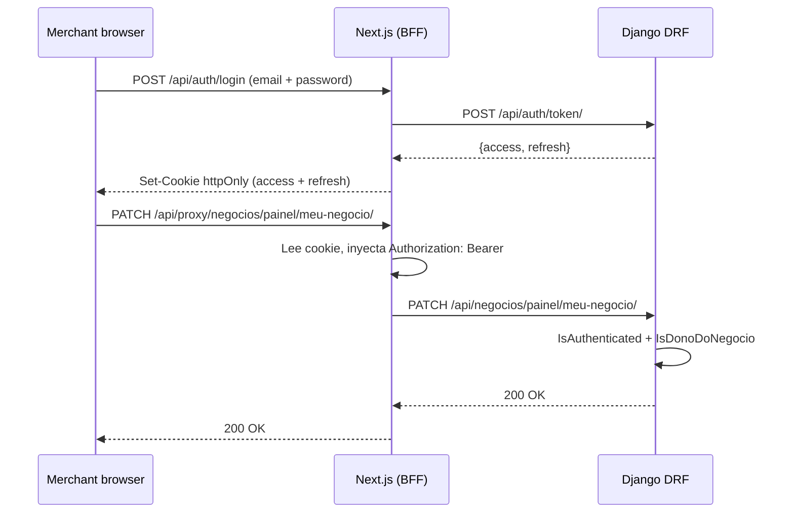
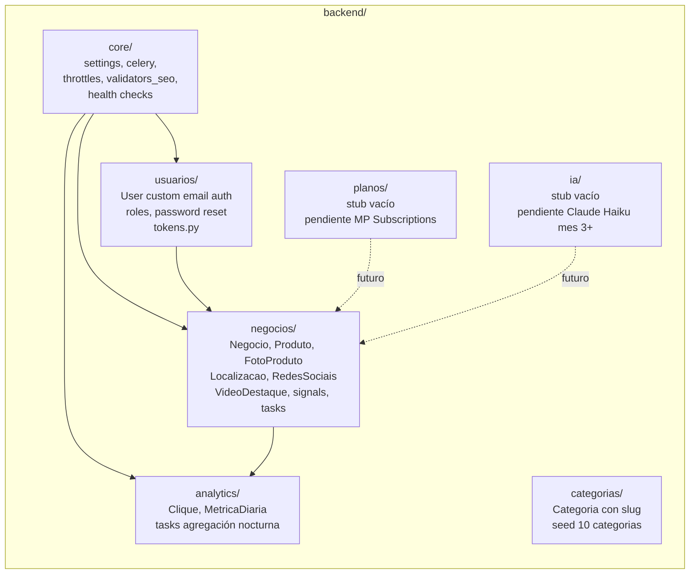
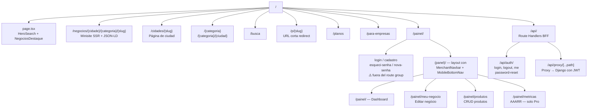

# DescubraSul — Arquitectura del Sistema

*Última actualización: 2026-07-12. Fuente de verdad: `CLAUDE.md` + `specs/`. Si hay discrepancia, el código gana.*

---

## Resumen ejecutivo

**DescubraSul** (descubrasul.com) es una vitrine digital regional para PMEs del Sur de Santa Catarina, Brasil (Criciúma, Içara, Tubarão y región). El producto da presencia digital profesional a negocios que hoy no la tienen o la tienen incompleta.

**Framing comercial:** hablar siempre de "vitrine", nunca de "diretório". El directorio es genérico y pasivo; la vitrine implica curaduría, presentación y venta activa del negocio.

**Usuarios:**
- **Merchant / dono de negócio** — PME que quiere presencia online sin construir un sitio propio.
- **Consumidor / usuario final** — persona buscando negocios locales por cidade/categoria.
- **Operador (Reinaldo)** — onboarding de merchants, analíticas agregadas, modelo de monetización.

**Modelo de negocio:** cuatro planes + plan "Fundador" (50 cupos, R$599/año). Diferenciador: onboarding manual de Google Business Profile — algo que la competencia automatizada no ofrece.

**Principio filtro de features:** ¿esto ayuda al merchant a mostrar mejor su negocio, o al usuario a encontrarlo más rápido? Si la respuesta no es clara, no es prioridad para el MVP.

---

## Estado actual (2026-07-12)

| Área | Estado |
|------|--------|
| Producción | ✅ Activo en www.descubrasul.com (PMV para validar apariencia/usabilidad) |
| Backend Django | ✅ Funcional — negocios, usuarios, analytics, categorias, CRUD de produtos |
| Panel del merchant | ✅ Alta atómica User+Negocio, auto-login, formulario completo, CRUD produtos |
| Password reset | ✅ Implementado y verificado (49 tests en verde, 3 bugs corregidos 2026-07-12) |
| Analíticas | ✅ Clique + MetricaDiaria, tracking, agregación nocturna Celery Beat |
| Páginas públicas | ✅ Minisite, cidades, categorías, busca, sitemap dinámico, URL corta /p/{slug} |
| Rediseño visual | ✅ Completado en `feat/redesign-visual-v1` (Playfair Display, CategoryCard, CityCard, PromoCard, scroll reveal) |
| IA (Claude Haiku) | ⏳ Pendiente — activar en mes 3+ solo para plan Pro |
| Assinaturas MP | ⏳ Pendiente — Mercado Pago Subscriptions |
| OAuth Google | ⏳ Pendiente — spec existe, scope sin definir |
| Token GitHub expuesto | 🔴 Bloqueante — revocar PAT `ghp_yLMV...` antes del lanzamiento |
| LGPD compliance | 🔴 Bloqueante — checkbox consentimiento, /privacidade, /termos, cookie banner |
| Ramas divergidas | 🔴 Pendiente — reconciliar `main` con `stable/etapa1-producao` |

---

## Stack técnico

| Capa | Tecnología |
|------|-----------|
| Frontend | Next.js 16 (App Router) + TypeScript + Tailwind CSS 4 |
| State management | Zustand + TanStack Query |
| Backend | Django 5 + Django REST Framework |
| Tareas asíncronas | Celery + Django Celery Beat |
| Base de datos | PostgreSQL 16 + pgvector (embeddings, búsqueda semántica) |
| Cache / Cola | Redis 7 |
| Autenticación | SimpleJWT (access 30min + refresh 7d, rotación + blacklist) |
| Hashing de contraseñas | Argon2 (primario) + PBKDF2 (fallback) |
| Media / Imágenes | Cloudflare R2 (S3-compatible) |
| Email transaccional | Resend SMTP |
| Pagos | Mercado Pago (suscripciones recurrentes) |
| Proxy reverso | Traefik v3 (SSL automático Let's Encrypt, sin panel intermediario) |
| Orquestación | Docker Compose puro |
| CI/CD | GitHub Actions → GHCR (GitHub Container Registry) |
| Infra | Hostinger VPS Ubuntu 24.04 |
| IA textos (futuro) | Claude Haiku 4.5 — solo plan Pro, mes 3+ |
| Búsqueda semántica | pgvector + multilingual MiniLM-L12-v2 (pendiente de setup) |

---

## Diagrama de arquitectura

---

## Flujo de request — página pública

---

## Flujo de request — panel del merchant (autenticado)

---

## Apps Django — responsabilidades

---

## Estructura de rutas frontend

---

## Tareas Celery programadas

| Tarea | Horario | Descripción |
|-------|---------|-------------|
| `agregar_metricas_diarias` | 00:30h diario | Agrega `Clique` → `MetricaDiaria` |
| `ocultar_produtos_vencidos` | 02:00h diario | Oculta produtos sin confirmación >30 días |
| `purgar_cliques_antigos` | 03:00h domingos | Purga eventos crudos antiguos |
| `geocodificar_localizacao` | On-demand (post_save) | Llama Google Maps API para lat/lng |

---

## Seguridad — capas de protección

| Capa | Mecanismo |
|------|-----------|
| Transporte | HTTPS obligatorio + HSTS 1 año (Traefik + Let's Encrypt) |
| Autenticación | SimpleJWT — access 30min, refresh 7d con rotación y blacklist |
| Hashing | Argon2 (primario) + PBKDF2 (fallback) |
| Autorización | `IsDonoDoNegocio` en todos los endpoints del merchant panel |
| Aislamiento de datos | `get_queryset()` filtra siempre por `negocio__usuario = request.user` |
| Rate limiting | Redis-backed throttles por scope: anon 60/min, user 200/min, auth 5/15min |
| Uploads | Validación por magic bytes (python-magic), no por extensión |
| CSP | Nonce-based por request en Next.js middleware (`strict-dynamic`) |
| CORS | Solo `descubrasul.com` y subdominios en producción |
| Cookies | `httpOnly`, `Secure`, `SameSite` en producción |

---

## Pendientes bloqueantes para lanzamiento comercial

| Prioridad | Ítem | Responsable |
|-----------|------|-------------|
| 🔴 Alta | Revocar PAT `ghp_yLMV...` + reconfigurar remote git sin credencial embebida | Reinaldo (acción manual) |
| 🔴 Alta | Reconciliar ramas `main` ↔ `stable/etapa1-producao` | Dev |
| 🔴 Alta | LGPD: checkbox consentimiento en /cadastro, /privacidade, /termos publicadas, cookie banner GA4, email privacidade@ | Dev + Reinaldo |
| 🟡 Media | `argon2-cffi` — rebuild del container backend (`docker compose build backend`) | DevOps |
| 🟡 Media | OAuth Google — definir scope antes de implementar (ver `specs/03-oauth-google.md`) | Reinaldo (decisión) |

---

## Archivos de configuración clave

| Archivo | Propósito |
|---------|-----------|
| `docker-compose.yml` | Stack de desarrollo local |
| `docker-compose.prod.yml` | Producción — Traefik labels, Gunicorn, servicios |
| `backend/core/settings/base.py` | Settings base Django (PASSWORD_RESET_TIMEOUT=3600, etc.) |
| `backend/core/settings/prod.py` | Overrides producción (HSTS, SECURE_PROXY_SSL_HEADER, etc.) |
| `frontend/src/middleware.ts` | CSP nonce-based + auth guard rutas del panel |
| `frontend/next.config.ts` | Config Next.js (source maps desactivados en prod) |
| `.env.prod` | Variables sensibles — **nunca versionar** |

---

*Specs de referencia: `specs/00-vision.md` (visión), `specs/01-seguridad.md` (compliance), `specs/02-crud-productos.md` (CRUD ref), `specs/03-oauth-google.md` (OAuth pendiente), `specs/04-password-reset.md` (password reset implementado).*
